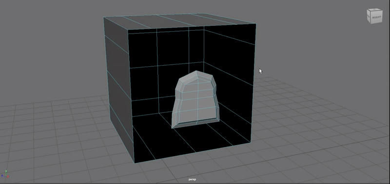
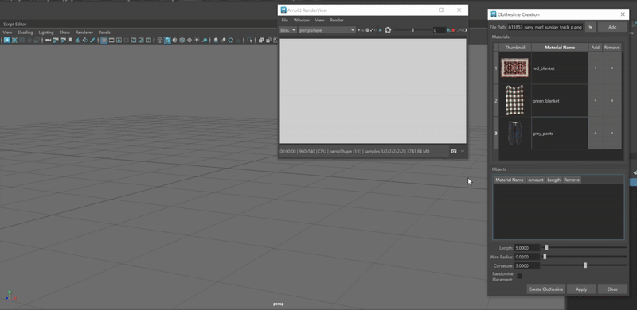
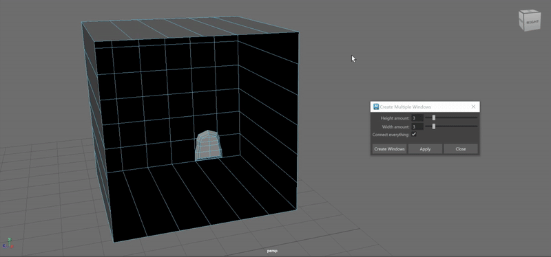
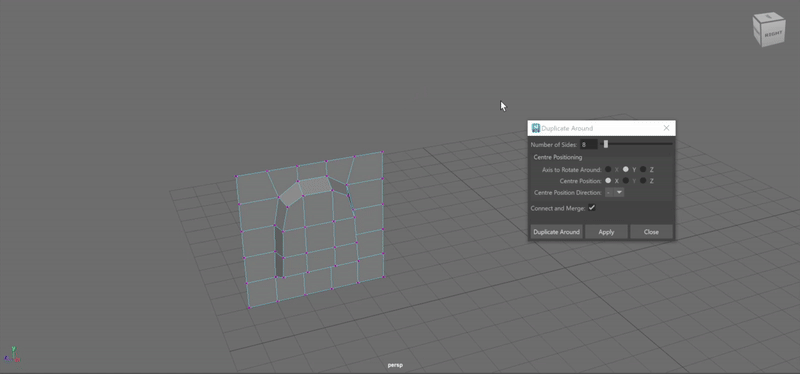

# maya-tools

These files are compatible with Maya 2023 through to Maya 2026.
These files should be placed within either the Maya scripts folder for the version you are currently using or within the general scripts folder for Maya.

To use these tools as items on a shelf, paste any code given below in either the command line or script editor, highlight it and middle mouse drag it onto a shelf. Make sure that, when prompted, the language of the shelf object is in Python.

## Auto Fill

### Description

This script allows for the user to fill the space between selected two sets of edge borders with tris and quads, no matter the difference in the number of edges they have.



### Usage

```python
import auto_fill as af

af.auto_fill()
```

This tool requires the selection of two edge borders within a single object, with one edge border residing in the empty space of the other edge border.

By default, the tool utilises Maya's Quadrangulate tool but if the user so chooses to, by writing False as an argument for auto_fill, they can have all the vertices in one edge border connect to their closest counterparts in the other edge border.

## Create Clothesline

### Description

This tool allows the user to create a clothesline from a set of textures.


### Usage

```python
from create_clothesline import clothesline_ui as clu

clu.ClotheslineDialog.show_dialog()
```

Through the UI, users can utilise images to create materials that serve as clothing on the clothesline. The tool automatically seeks files in the sourceimages folder of the current project but files in other folders can be selected. The name of the material can then be renamed.

From there, users can add these materials as many times as they require, with the order of the clothing added preserved when the clothesline is created. In addition, each individual clothing piece can have its amount and width adjusted or be removed entirely.

Finally, the clothesline itself can be manipulated, where you can change its length, wire radius, curvature and randomisation of clothing order.

## Create Windows

This tool, when selecting the edge borders of a window and an empty wall that are part of one mesh, creates multiples of the window as part of the wall that are all equally spaced.

### Description



### Usage

```python
from create_multiple_windows import create_multiple_windows_ui as cmwu

cmwu.MultipleWindowsDialog.show_dialog()
```

This tool requires that two edge borders of a single object with one edge border (the window) residing in the empty space of the other edge border (the wall).

Through the UI, users can specify how many windows they want both height-wise and width-wise. Additionally, they can choose to forgo connecting the windows and wall and just create multiples of the window instead.

It is important to note that the tool assumes that height runs along the y-axis and that users should ensure that their objects follow this convention. Additionally, it should be noted that loading times can significantly increase the more windows are made with roughly 25 windows being where loading times start to increase dramatically.

## Duplicate Around

This tool allows for the user to duplicate a mesh around a point a specified number of times and connect them by their edges.

### Description



### Usage

```python
from duplicate_around_point import duplicate_around_ui as dau

dau.DuplicateAroundDialog.show_dialog()
```

This tool requires that users select two vertices that differ in value only along one axis, which additionally serve as the points of connection for the other duplicated meshes.

After doing so, the UI requires that the user specify in what direction should the object rotate around and where should the centre of all these meshes be located. For example, the duplicated objects above utilised the UI to specify that the object should rotate around the y-axis and that the centre of these meshes should be in the negative x direction.

Users can then specify the number of meshes that should be created and if the meshes should be connected at all.

## Reload Modules

### Description

This tool reloads all modules found in a specified folder, which is by default the location of where the Reload Modules file is.

### Usage

```python
import reload_modules as rm

rm.reload_modules()
```

By default, all modules found in the directory where the Reload Modules file is are reloaded. To reload a specific folder, as a string argument specify the path of the directory you'd like to reload the modules of.
